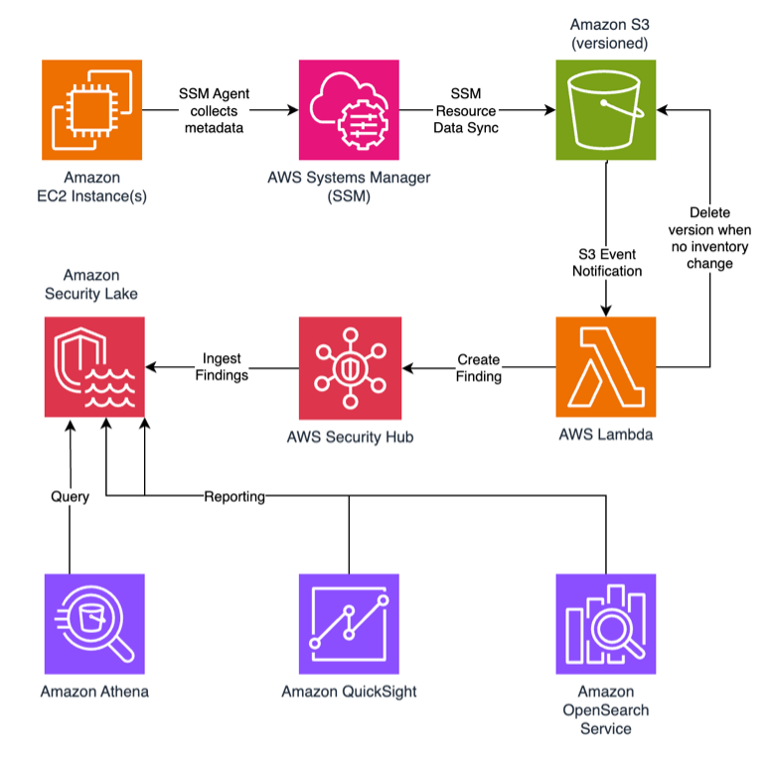

# sample-inventory-monitor-fim

> **⚠️ Note:** This is an implementation for demonstration an purposes. It is a sample and not production-ready tool.

## Overview

This sample demonstrates how to use **AWS Systems Manager (SSM) Inventory** to monitor file changes on Amazon EC2 instances, forward findings to **AWS Security Hub**, and store them in **Amazon Security Lake** for centralized analysis and visualization.  

The example focuses on **File Integrity Monitoring (FIM)**, but the same approach can be extended to monitor:  
- Installed applications  
- Network configurations  
- OS patches and updates  
- Custom inventory items  

## Architecture



This sample solution uses the following AWS services:

- [AWS Systems Manager](https://aws.amazon.com/systems-manager/) Inventory collects file metadata from managed [Amazon EC2](https://aws.amazon.com/ec2/) instances
- [Amazon S3](https://aws.amazon.com/s3/) stores inventory snapshots via SSM Resource Data Sync with versioning enabled
- [Amazon S3 Event Notifications](https://docs.aws.amazon.com/AmazonS3/latest/userguide/NotificationHowTo.html) trigger an [AWS Lambda](https://aws.amazon.com/lambda/) function when new inventory data arrives
- [AWS Lambda](https://aws.amazon.com/lambda/) function compares the latest inventory snapshot with the previous version to detect file changes (created, modified, or deleted files). Also a Lambda Layer provides reusable helper functions for the detection logic
- [AWS Security Hub](https://aws.amazon.com/security-hub/) receives findings in AWS Security Finding Format (ASFF)
- [Amazon Security Lake](https://aws.amazon.com/security-lake/) ingests findings in OCSF format for centralized analysis
- [Amazon Athena](https://aws.amazon.com/athena/) enables SQL queries on Security Lake data
- [Amazon QuickSight](https://aws.amazon.com/quicksight/) and [Amazon OpenSearch Service](https://aws.amazon.com/opensearch-service/) provide visualization and dashboarding capabilities

## Deployment

### Prerequisites

**AWS Services (Must be enabled before deployment):**
- ✅ **AWS Security Hub CSPM** - Must be enabled in the target Region. Open the Security Hub CSPM console and enable it if it isn’t already enabled.

**Local Requirements:**
- AWS CLI configured with appropriate credentials and valid region
- Python 3.9+ and pip installed
- S3 bucket for Lambda deployment packages
- The IAM principal running the deployment must be allowed to create CloudFormation stacks, Lambda functions, IAM roles, S3 buckets, and SSM resources.

**What Gets Deployed Automatically:**
- ✅ **S3 bucket** - Stores file metadata collected from EC2 instances (with versioning to track changes over time)
- ✅ **SSM Resource Data Sync** - Automatically exports inventory data from Systems Manager to the S3 bucket
- ✅ **SSM Inventory Association** - Schedules regular file metadata collection from all EC2 instances
- ✅ **Lambda function and Layer** - Serverless code that compares file versions and detects changes
- ✅ **S3 Event Notification** - Automatically triggers the Lambda function when new inventory data arrives

### Deployment Steps

1. **Clone this repository:**
   ```bash
   git clone https://github.com/aws-samples/sample-inventory-monitor-fim.git
   cd sample-inventory-monitor-fim
   ```

2. **Run the deployment script:**
   ```bash
   chmod +x deploy.sh
   ./deploy.sh DEPLOYMENT-BUCKET
   ```

   The script will:
   - Package the Lambda Layer with helper functions and dependencies
   - Package the Lambda function code
   - Upload both packages to the deployment bucket
   - Deploy the CloudFormation stack to your AWS CLI configured region (creates S3 bucket, SSM resources, Lambda)
   
   **Note:** The CloudFormation stack deploys to the region configured in your AWS CLI. To deploy to a different region, use:
   ```bash
   aws cloudformation deploy --region us-west-2 ...
   ```
   Or set the region before running the script:
   ```bash
   AWS_DEFAULT_REGION=us-west-2 ./deploy.sh DEPLOYMENT-BUCKET
   ```

   **Usage:**
   ```bash
   ./deploy.sh <deployment-bucket> [stack-name] [options]
   ```
   
   **Options (configure Lambda function behavior):**
   - `--monitored-path` - Which file path to monitor for file changes (default: `/etc/paymentapp/`)
   - `--file-patterns` - Regex patterns to identify critical files that trigger alerts (default: `^/etc/paymentapp/config.*$`)
   - `--severity` - Severity level for Security Hub findings (default: `MEDIUM`)
   - `--schedule` - How often to collect file metadata (default: `rate(30 minutes)`)

   **Examples:**
   
   Basic deployment:
   ```bash
   ./deploy.sh my-lambda-code-bucket
   ```
   
   Deploy to specific region:
   ```bash
   AWS_DEFAULT_REGION=us-west-2 ./deploy.sh my-lambda-code-bucket
   ```
   
   Custom configuration:
   ```bash
   ./deploy.sh my-lambda-code-bucket MyFimStack \
     --monitored-path /etc/ \
     --severity HIGH
   ```

### Verify Deployment

After deployment, verify the stack outputs:
```bash
aws cloudformation describe-stacks --stack-name InventoryMonitorFimSample --query 'Stacks[0].Outputs'
```

You should see:
- ✅ Inventory S3 bucket created (with versioning)
- ✅ SSM Resource Data Sync configured
- ✅ SSM Inventory Association active
- ✅ Lambda function `fim-change-detector` deployed
- ✅ Lambda Layer attached
- ✅ S3 Event Notification configured
- ✅ Deployment region displayed  

## Testing the Solution

### Step 1: Launch EC2 Instance

1. **Create IAM role for EC2:**
   - Go to IAM → Roles → Create role
   - Choose AWS Service → EC2
   - Attach `AmazonSSMManagedInstanceCore` policy
   - Name it `SSMAccessRole`

2. **Launch EC2 instance:**
   - Use Amazon Linux 2 AMI (t3.micro for testing)
   - Under Advanced details → IAM instance profile, select `SSMAccessRole`
   - Add user data to create test file:
     ```bash
     #!/bin/bash
     mkdir -p /etc/paymentapp
     echo "db_password=initial123" > /etc/paymentapp/config.yaml
     ```
   - Launch instance

### Step 2: Wait for Inventory Collection

The SSM Inventory Association runs on the schedule you configured (default: every 30 minutes).

**To manually trigger inventory collection:**
1. Go to Systems Manager → State Manager
2. Select your association (name: `<StackName>-file-inventory`)
3. Click Apply association now
4. Wait for status to show Success

### Step 3: Simulate File Change

1. Connect to EC2 instance via Systems Manager Session Manager
2. Modify the test file:
   ```bash
   echo "db_password=hacked456" | sudo tee /etc/paymentapp/config.yaml
   ```
3. Trigger inventory collection again (or wait for next scheduled run)

### Step 4: Verify Finding

**Check Security Hub:**
- Go to Security Hub CSPM → Findings
- Look for finding with title: "File changes detected via SSM Inventory"

  

## Amazon Security Lake Integration (Optional)

Amazon Security Lake can automatically collect and normalize findings from AWS Security Hub into the Open Cybersecurity Schema Framework (OCSF) format. Once Security Lake is enabled with Security Hub as a data source, all FIM findings will be automatically ingested without any code changes. This enables centralized security data analysis across multiple AWS accounts and regions. Security Lake data can be queried using Amazon Athena and visualized with Amazon QuickSight or Amazon OpenSearch Service for dashboards and reporting.

  

## Project Structure

```
.
├── lambda_function.py          # Main Lambda handler
├── layer/
│   ├── helpers.py             # Helper functions for FIM logic
│   └── requirements.txt       # Python dependencies (python-dateutil)
├── deploy.sh                  # Automated deployment script
├── template.yaml              # CloudFormation template
├── res/
│   └── architecture.png       # Architecture diagram
└── README.md                  # This file
```

## Cleanup

To remove all resources and avoid ongoing costs:

1. **Terminate EC2 test instances**
2. **Empty/delete the inventory S3 bucket**
3. **Delete the CloudFormation stack:**
   ```bash
   aws cloudformation delete-stack --stack-name InventoryMonitorFimSample
   ```
4. **Clean up local files:**
   ```bash
   rm -rf build/ *.zip
   ```

The CloudFormation stack deletion will automatically remove all deployed resources including Lambda functions, S3 buckets, SSM configurations, and IAM roles.  

## License

This sample is licensed under the **MIT-0 License**. See [LICENSE](./LICENSE) for details.  
